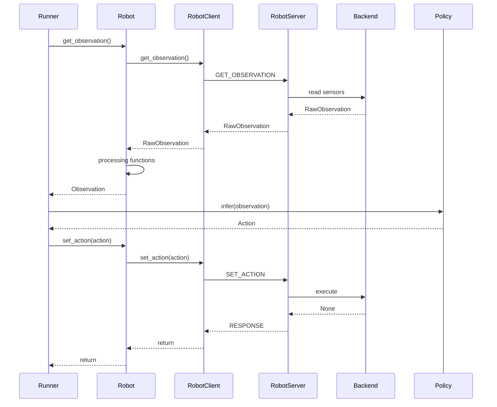

# RoboHub 真机部署与代码结构

## 1. 目标架构

RoboHub 采用机器人端和工作站端两端部署：

- **机器人端**运行通用 `RobotServer`，通过 `RobotBackend` 适配厂家 `RobotSDK`、ROS Topics 或其他硬件接口。
- **工作站端**运行 `RobotClient`、`Robot`、观测处理函数和 `Policy`，完成数据处理与策略推理。
- **网络通信**由工作站主动调用机器人端的 `get_observation` 和 `set_action`。
- **标准 Schema**（`RawObservation`、`Observation` 和 `Action`）是两端之间的唯一数据契约，不依赖厂家 SDK、ROS 或 Policy。

```text
RobotSDK / ROS Topics
          │
          ▼
┌─────────────────────┐
│    RobotBackend     │  硬件适配、数据转换、动作执行
└──────────┬──────────┘
           │ RawObservation / Observation / Action
           ▼
┌─────────────────────┐
│    RobotServer      │  协议、网络、序列化、错误处理
└──────────┬──────────┘
           │ network
           ▼
┌─────────────────────┐
│    RobotClient      │  工作站端通信代理
└──────────┬──────────┘
           ▼
┌─────────────────────┐
│       Robot         │  工作流编排与统一接口
└──────────┬──────────┘
           │
           ├── processing 函数
           └── Observation
                       │
                       ▼
                    Policy
                       │ Action
                       └──────────────► Robot
```

## 2. 机器人端

### 2.1 `RobotServer`：通用网络服务

`RobotServer` 是 RoboHub 实现的通用服务端，组合一个 `RobotBackend`：

```python
class RobotServer:
    def __init__(
        self,
        backend: RobotBackend,
        *,
        host: str = "127.0.0.1",
        port: int = 8765,
        timeout: float = 5.0,
    ) -> None: ...

    def serve_forever(self) -> None: ...
    def close(self) -> None: ...
```

职责：

- 管理 TCP 网络连接；
- 解析请求并分发 `get_observation`、`set_action` 等操作；
- 负责长度前缀、协议版本和 MessagePack 序列化；
- 管理请求超时、断连和错误返回；
- 调用后端获取观测或执行动作；
- 返回标准 Schema。

`RobotServer` 不直接导入厂家 SDK 或 ROS，不实现点云、分割和 Policy 逻辑。

### 2.2 `RobotBackend`：机器人硬件适配层

`RobotBackend` 是机器人端连接 RoboHub 与真实硬件的抽象接口：

```python
class RobotBackend(Protocol):
    def get_observation(self) -> Observation | RawObservation: ...
    def set_action(self, action: Action) -> None: ...
    def close(self) -> None: ...
```

职责：

- 初始化和关闭厂家 SDK、ROS 节点及硬件资源；
- 读取 RGB、Depth、关节位置和其他传感器数据；
- 将 SDK / ROS 数据转换为 `Observation` 或 `RawObservation`；
- 处理硬件关节名称、顺序、单位和坐标系映射；
- 校验并执行 `Action`；
- 执行必要的硬件安全检查、控制模式检查和过期动作检查；
- 管理传感器等待、缓存和硬件异常。

后端可以按接口来源拆分：

```text
MyRobotBackend
├── ArmDriver       → RobotSDK
├── CameraSource    → ROS Topics
└── StateSource     → SDK 或 ROS Topics
```

只有当组件需要独立复用、替换或测试时，才继续拆分为更细的 driver/source 类。初期可以使用一个 `MyRobotBackend` 组合 RobotSDK 与 ROS。

示例：

```python
backend = MyRobotRosBackend(robot_config)
server = RobotServer(backend, host="0.0.0.0", port=8765, timeout=30.0)
server.serve_forever()
```

机器人端不依赖工作站端的 `Robot`、`processing` 或 `policies`。

## 3. 工作站端

### 3.1 `RobotClient`：通用通信代理

如果所有机器人使用相同的网络协议、Schema 和错误模型，则 `RobotClient` 不需要为每种机器人派生一个客户端：

```python
class RobotClient:
    def get_observation(
        self,
        expected_type: type[ObservationT] = Observation,
    ) -> ObservationT: ...

    def set_action(self, action: Action) -> None: ...
    def close(self) -> None: ...
```

职责：

- 连接 `RobotServer`；
- 发起观测和动作请求；
- 序列化和还原标准 Schema；
- 处理网络超时、断连和远端错误；
- 不处理点云、分割、模型推理或厂家 SDK。

当前客户端在首次请求时建立连接并复用 Socket；连接失效后由调用方关闭或重新创建客户端。

只有在协议确实不同或需要机器人特定通信扩展时，才实现具体客户端子类。

### 3.2 `Robot`：工作站端统一机器人对象

`Robot` 是 Policy 和应用程序使用的上层对象，负责组合客户端、配置和观测流程：

```python
class Robot:
    def get_observation(self) -> Observation: ...
    def set_action(self, action: Action) -> None: ...
    def reset(self) -> None: ...
    def close(self) -> None: ...
```

职责：

- 调用 `RobotClient` 获取 `Observation`，或将 `RawObservation` 解码为 `Observation`；
- 组合 `RobotClient`、`Policy` 和机器人配置，编排观测、推理、动作与复位流程；
- 对外隐藏网络通信、原始数据格式和机器人配置细节。

当前 `AstribotRobot` 在工作站端解码 RGB / Depth、执行复位插值、转换 `Action` 与 25 维关节位置，并通过 URDF 提供正向运动学；动作维度、有限值和控制权校验由 `AstribotBackend` 执行。

`Robot` 不应重新实现所有处理算法，也不应变成工具函数集合。它只负责调用处理函数并编排数据流。

### 3.3 工作站端处理函数

无状态观测处理放在 `processing` 模块中，以普通函数形式实现：

```python
def get_point_cloud(
    rgb,
    depth,
    color_intrinsics,
    depth_intrinsics,
    depth_to_color,
): ...

def transform_points(points, transform): ...
```

适合使用函数的处理包括：

- depth 到点云投影；
- 坐标变换；
- 点云裁剪和采样；
- 图像归一化；
- 无状态的 segmentation 后处理；
- `RawObservation` 到 `Observation` 的组装。

以下情况可以使用独立的类，但不必统一称为 `Processor`：

- segmentation 模型需要长期驻留 GPU；
- 视频跟踪、滤波或点云融合需要跨帧状态；
- 处理过程需要管理昂贵的缓存或运行资源。

当前 `Visual` 使用 Viser 管理机器人模型、相机视锥和点云等持续资源，因此实现为有状态类；其他无状态处理继续使用普通函数。

### 3.4 `Policy`

```python
class Policy:
    def infer(self, observation: Observation) -> Action: ...
    def reset(self) -> None: ...
    def close(self) -> None: ...
```

Policy 只依赖标准的 `Observation` 和 `Action`，不直接依赖 `RobotClient`、RobotSDK、ROS 或网络协议。

## 4. 部署拓扑

```text
┌──────────────────────────── 机器人端 ───────────────────────────┐
│                                                                 │
│  ┌──────────────────┐      ┌──────────────────┐                 │
│  │     RobotSDK     │      │    ROS Topics    │                 │
│  └─────────┬────────┘      └─────────┬────────┘                 │
│            └──────────────┬──────────┘                          │
│                           ▼                                     │
│                  ┌─────────────────┐                            │
│                  │  RobotBackend   │                            │
│                  │ hardware adapt. │                            │
│                  └────────┬────────┘                            │
│                           ▼                                     │
│                  ┌─────────────────┐                            │
│                  │   RobotServer   │                            │
│                  │ network/protocol│                            │
│                  └────────┬────────┘                            │
└───────────────────────────┼─────────────────────────────────────┘
                            │ TCP（当前）
                            │ RawObservation / Observation / Action
┌───────────────────────────┼─────────────────────────────────────┐
│                           ▼                         工作站端     │
│                  ┌─────────────────┐                            │
│                  │   RobotClient   │                            │
│                  └────────┬────────┘                            │
│                           ▼                                     │
│                  ┌─────────────────┐                            │
│                  │      Robot      │                            │
│                  │ workflow orches.│                            │
│                  └────────┬────────┘                            │
│                           │                                     │
│        processing functions + robot-specific config             │
│                           ▼                                     │
│                     Observation                                │
│                           ▼                                     │
│                        Policy                                    │
└─────────────────────────────────────────────────────────────────┘
```

## 5. 推荐代码结构

```text
RoboHub/
├── pyproject.toml
├── README.md
├── assets/
│   └── astribot/
│
├── src/
│   └── robohub/
│       ├── __init__.py
│       │
│       ├── communication/
│       │   ├── __init__.py
│       │   ├── protocol.py
│       │   ├── serialization.py
│       │   ├── errors.py
│       │   ├── robot_server.py
│       │   └── robot_client.py
│       │
│       ├── schemas/
│       │   ├── __init__.py
│       │   ├── observation.py
│       │   ├── raw_observation.py
│       │   └── action.py
│       │
│       ├── backends/
│       │   └── base.py
│       │
│       ├── robots/
│       │   ├── __init__.py
│       │   ├── base.py
│       │   │
│       │   ├── astribot/
│       │   │   ├── __init__.py
│       │   │   ├── backend.py
│       │   │   ├── robot.py
│       │   │   └── configs/
│       │   │       └── default.yaml
│       │   │
│       │   └── my_robot/
│       │       ├── __init__.py
│       │       ├── backend.py
│       │       ├── robot.py
│       │       └── configs/
│       │           └── default.yaml
│       │
│       ├── processing/
│       │   ├── __init__.py
│       │   ├── visual.py
│       │   ├── point_cloud/
│       │   │   └── get_point_cloud.py
│       │   └── transforms/
│       │       └── __init__.py
│       │
│       ├── policies/
│       │   ├── base.py
│       │   └── my_policy/
│       │       ├── policy.py
│       │       ├── model/
│       │       ├── data/
│       │       ├── config/
│       │       └── scripts/
│       │
│       └── utils/
│           ├── config.py
│           ├── logging.py
│           └── timing.py
│
├── scripts/
│   └── astribot_env.sh
│
├── tests/
│
└── docs/
```

## 6. 控制调用时序



上图展示 Astribot 的 `RawObservation` 路径；能够直接生成标准数组的 Backend（例如 `MyRobotBackend`）也可以返回 `Observation`，此时 `Robot` 不需要执行图像解码。

公共 `Robot` 接口当前不定义 IK/FK；`AstribotRobot` 已在工作站端使用 URDF 提供 `forward_kinematics()`，该计算不经过机器人端网络服务。

## 7. 最小实现顺序

1. 在 `schemas` 中定义 `RawImage`、`RawObservation`、`Observation` 和 `Action`。
2. 完成 `communication` 中的协议、序列化、错误类型以及通用 `RobotServer`、`RobotClient`。
3. 在 `backends/base.py` 中定义 `RobotBackend` 接口。
4. 实现当前机器人的 SDK / ROS backend，打通传感器读取和动作执行。
5. 将 backend 注入通用 `RobotServer`，完成机器人端网络闭环。
6. 实现通用 `RobotClient` 的连接、请求响应和 Schema 类型校验。
7. 实现 `processing` 中的无状态观测处理函数。
8. 实现工作站端 `Robot`，根据机器人配置解码或组装 `Observation`。
9. 实现 `policies` 并将 `Policy.infer()` 接入控制循环。
10. 根据实际性能和需求增加压缩、流式通信、缓存、跨帧处理或模型类。
